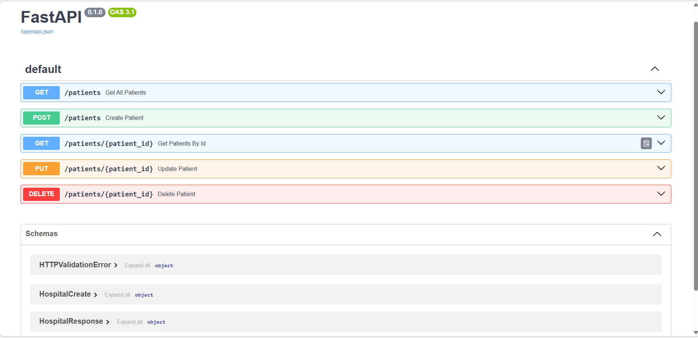

🏥 Hospital Patient Management System

A full-stack web application designed to efficiently manage hospital patient records.
The system allows hospital staff to add, view, update, and delete patient details through a simple and interactive interface.

This project demonstrates backend API development, database integration, and frontend interface design using modern Python technologies.

🚀 Project Overview

Hospitals often face challenges in maintaining patient records manually, which can lead to data inconsistency and difficulty in accessing information quickly.

This application digitizes patient record management by providing a centralized platform where hospital staff can easily manage patient information in real time.

⚙️ Tech Stack

Backend

Python

FastAPI

SQLAlchemy

Pydantic

Frontend

Streamlit

Database

PostgreSQL

🧩 System Architecture
User
   │
   ▼
Streamlit (Frontend UI)
   │
   ▼
FastAPI (Backend API)
   │
   ▼
SQLAlchemy ORM
   │
   ▼
PostgreSQL Database

The system follows a request–response architecture where the frontend sends HTTP requests to the backend API, which processes the request and interacts with the database.

✨ Key Features

✔ Add new patient records
✔ View all admitted patients
✔ Update patient details
✔ Delete patient records
✔ Input validation and error handling
✔ Real-time database interaction

📂 Project Structure
hospital_patient_management_system
│
├── backend
│   ├── database.py
│   ├── database_models.py
│   ├── models.py
│   └── main.py
│
├── frontend
│   └── app.py
│
├── requirements.txt
└── README.md
🔧 Installation & Setup
1️⃣ Clone the Repository
git clone https://github.com/NAVYATIKE/Hospital-Patient-Management-System.git
2️⃣ Navigate to Project Folder
cd hospital-patient-management-system
3️⃣ Install Dependencies
pip install -r requirements.txt
4️⃣ Run Backend (FastAPI)
uvicorn main:app --reload
5️⃣ Run Frontend (Streamlit)
streamlit run app.py
📊 API Endpoints
Method	Endpoint	Description
GET	/patients	View all patients
GET	/patients/{id}	View patient by ID
POST	/patients	Add new patient
PUT	/patients/{id}	Update patient
DELETE	/patients/{id}	Delete patient
🧠 Learning Outcomes

Through this project, I gained hands-on experience in:

Full-stack application development

REST API design using FastAPI

Database modeling and ORM integration

Building interactive web interfaces with Streamlit

Implementing validation and error handling

🔮 Future Enhancements

User authentication and role-based access

Cloud deployment

Appointment scheduling system

Analytics dashboard for hospital data

🙏 Acknowledgement

I would like to sincerely thank my mentor, trainer, and faculty members for their continuous guidance, support, and encouragement throughout the development of this project.

📌 Author

Navya Atike
AI & ML Engineering Student | Aspiring AI & Full Stack Developer

⭐ If you find this project useful, feel free to star the repository!

## 📸 Application Screenshots

### architecture 
![Sample]
())

### Backend 
![End Points]
()

### 📋 View Patient Records
![View Patients]
()

### ➕ Add New Patient
![Add Patient]
()

### ✏ Update Patient Details
![Update Patient]
()

### 🗑️ Update Patient Details
![Delete Patient]
()